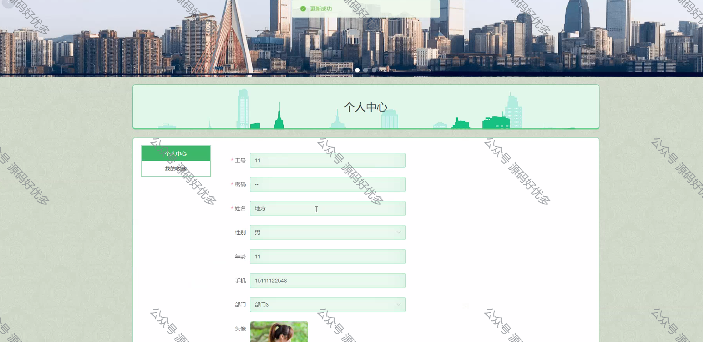

 
## 查看主页获取源码

> **作者介绍**： **✌**全网粉丝10W+本平台特邀作者、博客专家、CSDN新星计划导师、java领域优质创作者,博客之星、掘金/华为云/阿里云/InfoQ等平台优质作者、专注于项目实战 **✌**

  

### 一、作品包含

源码+数据库+设计文档万字+PPT+全套环境和工具资源+部署教程

### 二、项目技术

前端技术：Html、Css、Js、Vue、Element-ui

数据库：MySQL

后端技术：Java、Spring Boot、MyBatis

  

### 三、运行环境

开发工具：IDEA/eclipse

数据库：MySQL5.7

数据库管理工具：Navicat10以上版本

环境配置软件： JDK1.8+Maven3.6.3

前端Nodejs：14

### 四、项目介绍
项目编号：springbootA123

智能交通信息平台，旨在提高交通系统的运行效率，减少交通拥堵，保障交通安全，同时为出行者提供实时、准确的交通信息服务，推动交通行业的智能化、绿色化发展。

前台员工功能：首页、信息共享、交通信息、交通辅助、重大事件、后台管理和个人中心。

后台分为管理员和员工
管理员的功能：系统首页、个人中心、员工管理、部门信息管理、信息类型管理、信息共享管理、交通信息管理、交通辅助管理、重大事件管理和系统管理。
员工的功能：系统首页、个人中心、信息共享管理、交通信息管理、交通辅助管理和重大事件管理。

### 五、运行截图

  
